Practica03-Validacion-De-Datos
==============================

**1. Creación una interfaz de formulario**

**- Página Index.html**

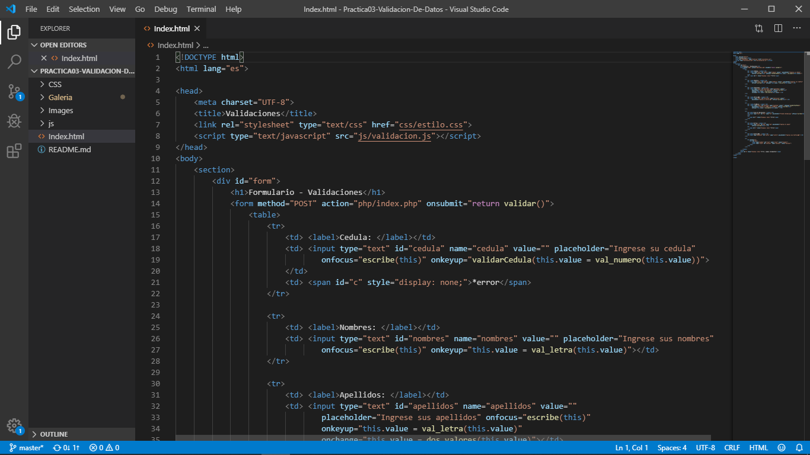

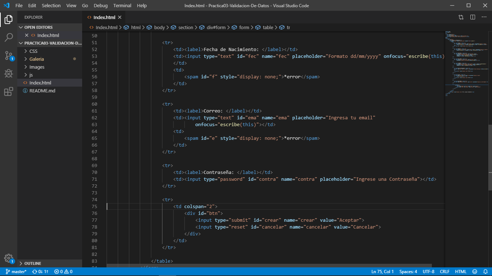

**-Creacion del archivo ccs**

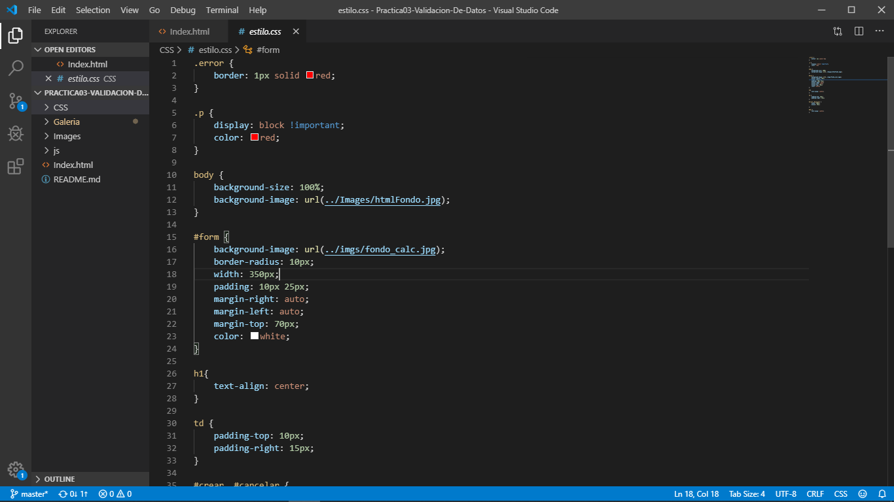

**Validacion para la Cedula en js**

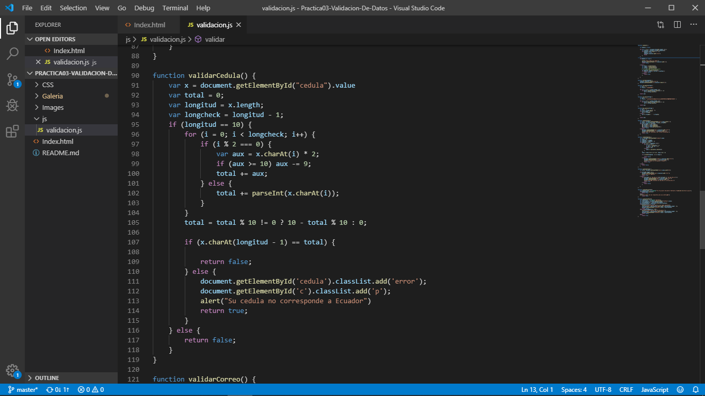

**-Validacion del nombre en js**

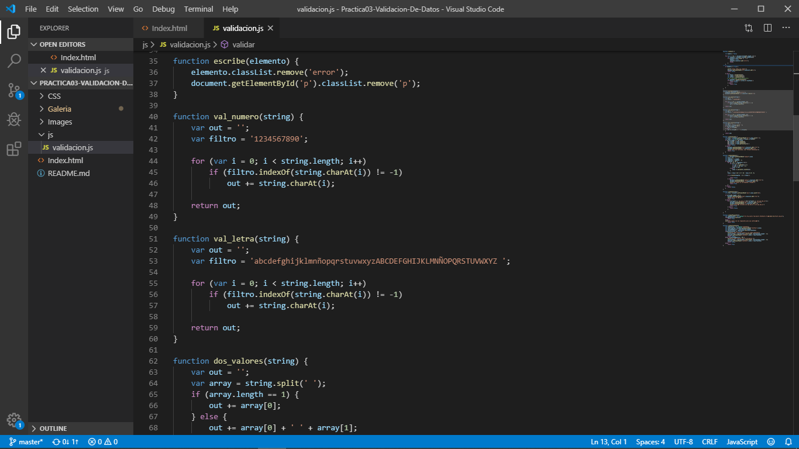

**-Validar el campo de tlefono que solo ingrese 10 numeros**

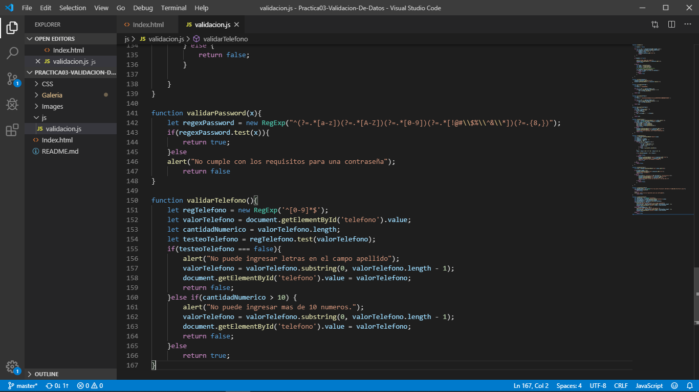

**-validar la fecha de nacimiento bajo el formato dd/mm/yyyy**

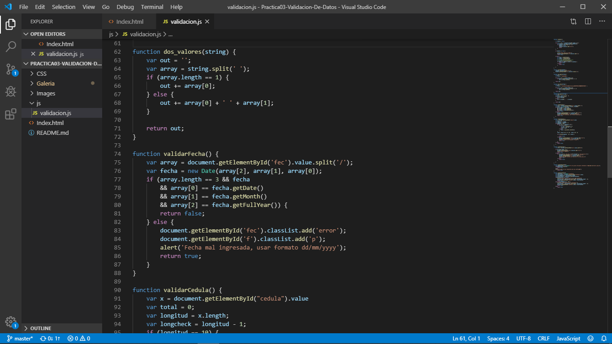

**-Validar el campo correo que tenga la extencion est.ups.edu.ec**

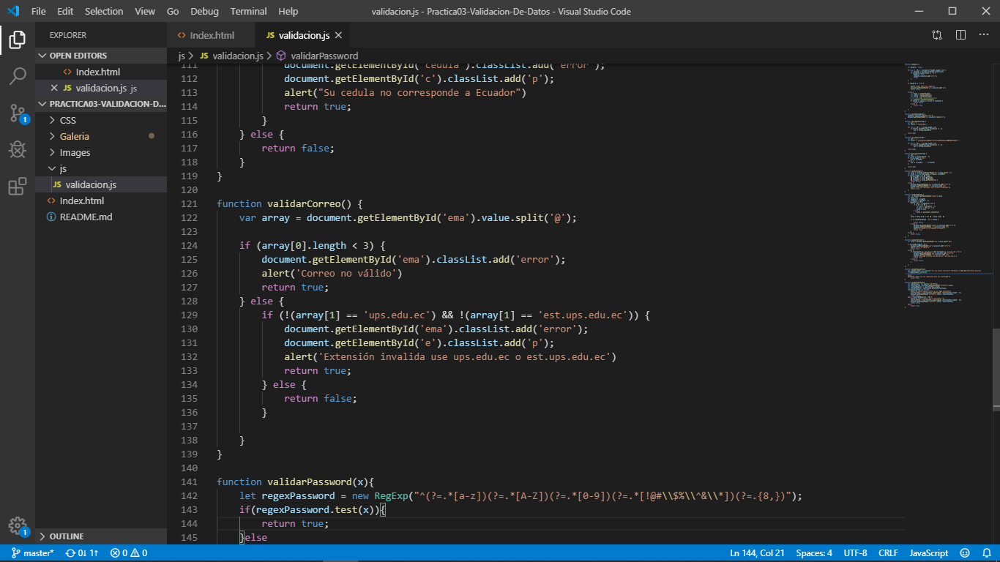

**Validacion de la contraseña con caracteres Especiales**

**2. Creación de una Interfaz para la presentación de una galería de imágenes**

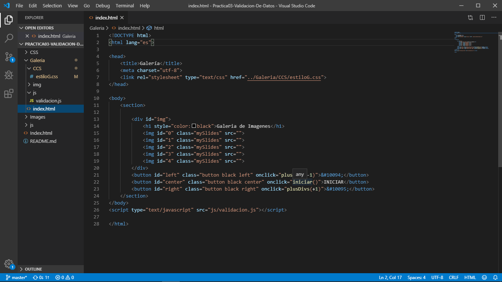

**-Creacion del archivo ccs**

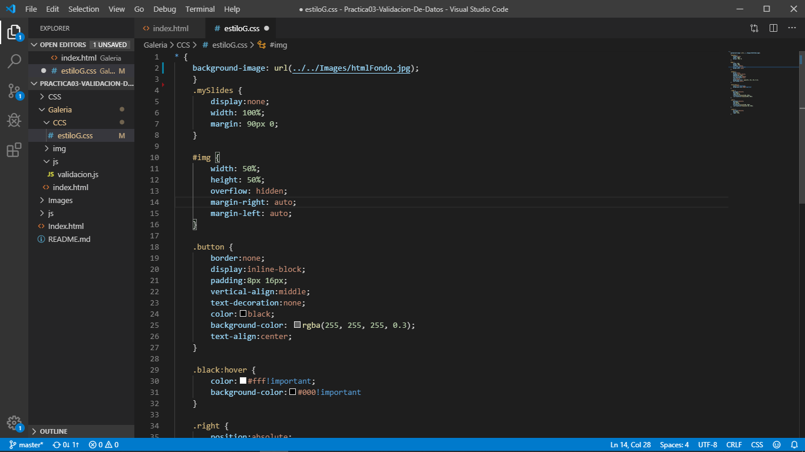

**-Validacion del movimiento de las imágenes en js**

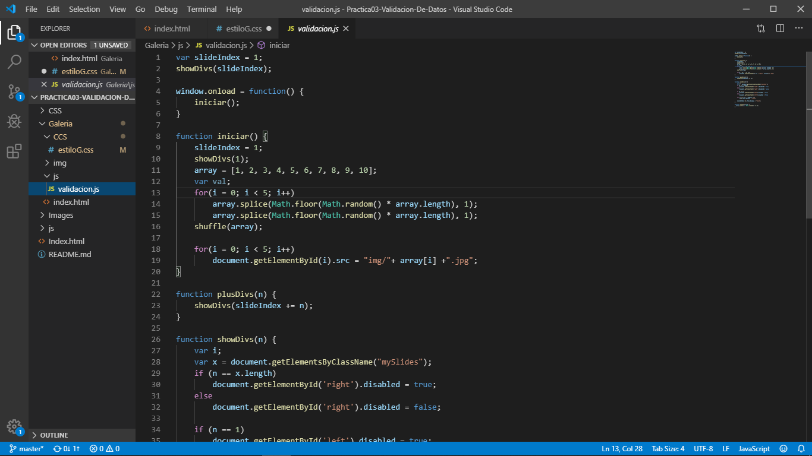

**Información Github:**

**----------PRACTICA----------**

**Usuario: wonejo92**

**URL:** <https://github.com/wonejo92/Practica03-Validacion-De-Datos.git>

**RESULTADO(S) OBTENIDO(S)**:

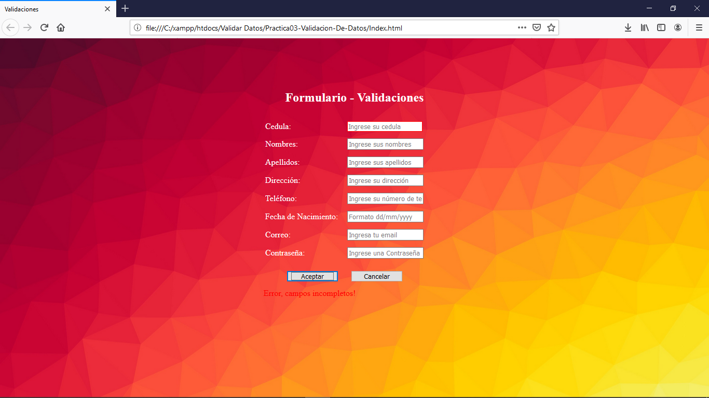

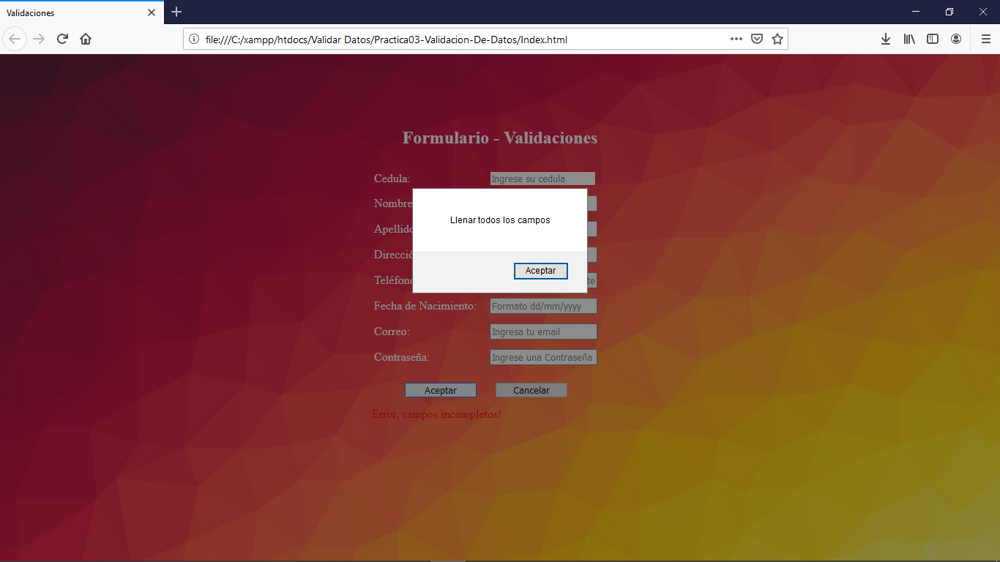

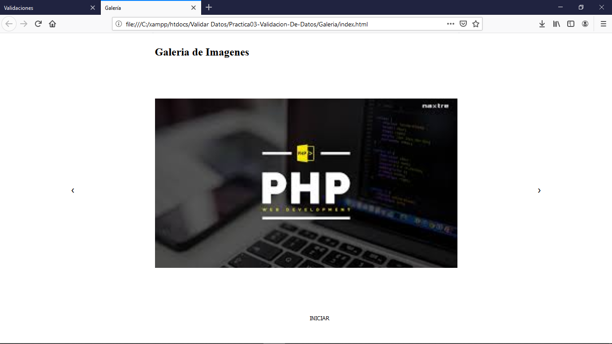

**CONCLUSIONES**:

Los estudiantes deben poder organizar sitios web basados en el lenguaje de
etiquetado HTML.

**Nombre de estudiante:**

>   **Kevin Cordero**

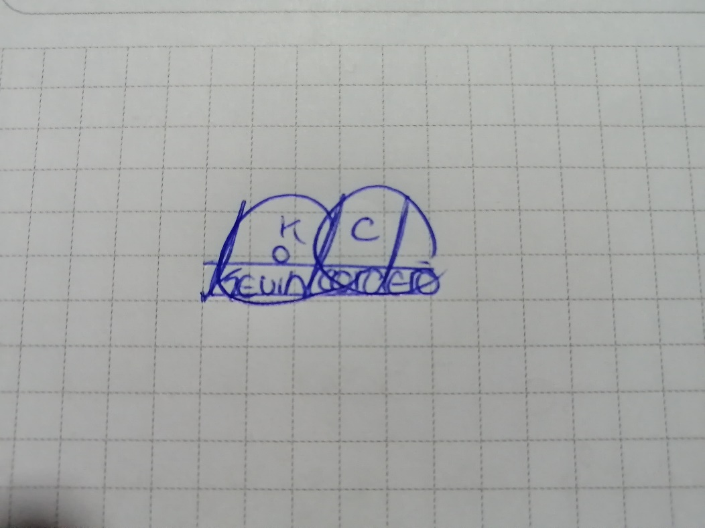
